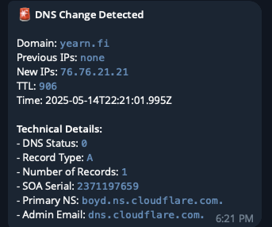

# DNS Monitor Bot

A simple to configure, pre-built Cloudflare Worker that monitors DNS records for any list of user-specified domains and sends notifications via Telegram when changes are detected.

The project is designed to stay comfortably within Cloudflare's free tier for it's Worker and KV storage services.

Example alert:

<p align="center">
  
</p>

## Prerequisites

- [Node.js](https://nodejs.org/) (v20 or later)
- [npm](https://www.npmjs.com/) (comes with Node.js)
- [Wrangler CLI](https://developers.cloudflare.com/workers/wrangler/install-and-update/) (v4 or later)

## Setup

1. **Clone the repository:**

   ```bash
   git clone https://github.com/wavey0x/dns-bot.git
   cd dns-bot
   ```

2. **Install dependencies:**

   ```bash
   npm install
   ```

3. **Configure your bot and secrets:**

   - Create a `.env` file in the project root and supply values:

     ```bash
     cp .env.example .env
     ```

   - Supply the same variables and values as github actions secrets within your repository's settings.[^1]

   - Update `config.json` with your settings:

     ```json
     {
       "domains": ["domain1.com", "domain2.com"],
       "cron": "*/5 * * * *",
       "kvNamespace": {
         "id": "your-kv-namespace-id"
       }
     }
     ```

   - Get your Cloudflare API token[^2]

4. **Deploy the bot:**

   - **Option 1: Deploy locally**

     Run the deploy script:

     ```bash
     npm run deploy
     ```

     This will:

     - Set up the KV namespace if needed
     - Configure Telegram secrets
     - Update the worker configuration
     - Deploy to Cloudflare Workers

   - **Option 2: Deploy via GitHub Actions**

     - Push your changes to the `main` branch.
     - The GitHub Action will automatically deploy the bot.

## Viewing Logs

To view the logs for your deployed worker:

1. Go to the [Cloudflare Dashboard](https://dash.cloudflare.com/).
2. Navigate to **Workers & Pages**.
3. Select your worker (`dns-bot`).
4. Click on **Logs** to view the worker's logs.

## Troubleshooting

- **Wrangler not found:** Ensure Wrangler is installed globally or use `npx wrangler`.
- **Deployment fails:** Check your API token and ensure all environment variables are set correctly.
- **No logs:** Ensure logging is enabled in your `wrangler.toml` file.
- **GitHub Actions fails:** Verify that all required secrets are set in your repository's Settings > Secrets and variables > Actions.

## Footnotes

[^1]: Required secrets must be set in both your local `.env` file and GitHub Actions repository secrets. Go to your repository's Settings > Secrets and variables > Actions and add: `CLOUDFLARE_API_TOKEN`, `TELEGRAM_BOT_TOKEN`, and `TELEGRAM_CHAT_ID`.
[^2]: To get your Cloudflare API token:

    1. Go to the [Cloudflare Dashboard](https://dash.cloudflare.com/)
    2. Navigate to **My Profile** > **API Tokens**
    3. Click **Create Token**
    4. Choose **Create Custom Token**
    5. Set the following permissions:
       - **Account** > **Workers** > **Edit**
       - **Zone** > **DNS** > **Read**
    6. Set the **Account Resources** to **All accounts**
    7. Set the **Zone Resources** to **All zones**
    8. Click **Continue to summary** and then **Create Token**
